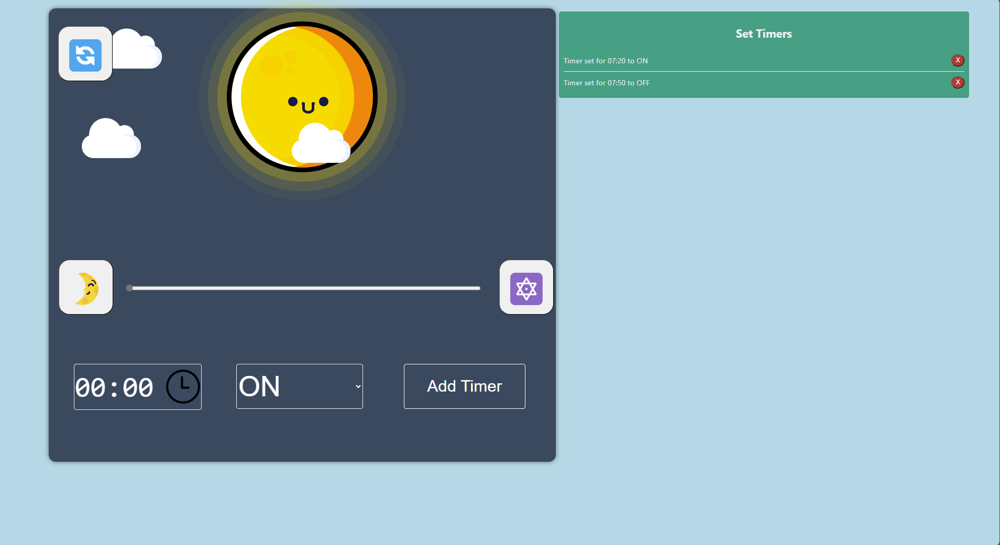
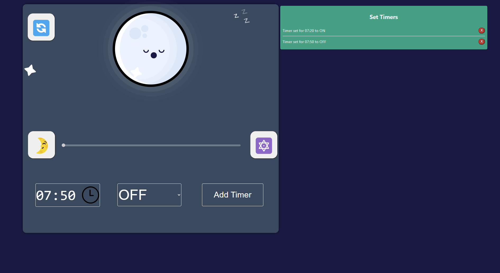

# Light-Controll
A Webserver to controll the light in a room

## Idea
The light in my room is capable of changing the brightness / color via a remote controll. 
Since i only have normal light switches i am not capable of controlling these states.
To get rid of this problem a webpage for mobile phones and computers has been written.
Now i can place old tablets over my normal light switches to have better controll of the light.
Also i am now capable of controlling the light over mobile end devices.

## Server
To host the webpage a esp32 controller is used as a server. The esp32 has a static ip address and is responsible for controlling the timers. Through this server concept multiple devices can controll the light simultaniously.

## Webpage
The webpage has 
- On/Off Button
- Nightmode Button
- Color Change Button
- Brightness Range
- Timer Display

The sun shines if the light is on and if the light is off the moon is displayed. Also is a cloud animation programmed which turns into stars in the night. 
### Light On

### Light Off

